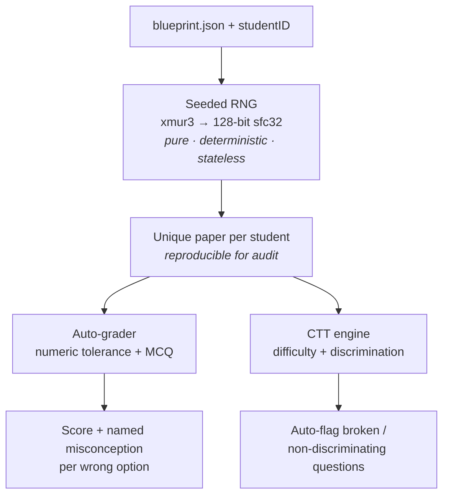

# Maya-Exana — Fair Exams, By Design

  

> **FAR AWAY 2026 · Theme: Examinations**
> Stopping exam fraud by making it *pointless* — not by spying on students.
>
> **Role:** Lead Developer & Architect (solo build)

> ℹ️ *The badge URLs point to shields.io; once you push to GitHub and enable the CI workflow
> in `.github/workflows/ci.yml`, swap the build badge for the live Actions badge:*
> ``

Maya-Exana reimagines exam integrity around a contrarian thesis: the future of fair
examinations is **not** more invasive AI proctoring (webcams, face-tracking, eye-gaze —
opaque, biased, and banned in a growing number of jurisdictions). The future is
**designing assessments that cannot be cheated in the first place**, grading them
instantly and transparently, and giving examiners real psychometric insight.

**It's a working engine, not a slide deck.** Open `index.html`, or run `node demo.js`.

> 🔴 **Live demo:** open `index.html` (works fully offline, one click) — or host it free on GitHub Pages and put the link here: `https://<your-username>.github.io/maya-exana`.
> ▶️ **3-minute video walkthrough:** `[PASTE VIDEO LINK HERE]`
> ⚡ **Verify it's real:** `git clone … && cd maya-exana && node tests/engine.test.js` → **65/65 passing in < 1s, zero install**.

## How it works (10-second overview)



Plain-text version (for renderers without Mermaid):

```
blueprint.json + studentID
        |
        v
  [ seeded RNG ]  --pure, deterministic, stateless-->  unique paper per student
        |
        v
  [ auto-grader ] --numeric tolerance + MCQ--> score + misconception feedback
        |
        v
  [ CTT engine ]  --difficulty + discrimination--> auto-flag broken questions

  No server session state. No DB read to GENERATE a paper.
  => N stateless instances behind a load balancer can serve 500,000 candidates.
```

**Who it's for (concrete):** a secondary-school teacher running a unit test. 3 steps —
(1) author a blueprint in **Blueprint Studio**, (2) share one link with student IDs,
(3) download graded results + a question-health report. No proctoring software to install.

**Why it isn't an "AI wrapper":** the trust-critical path (generation, grading, psychometrics)
makes **zero API calls** — it's auditable offline math. AI is optional authoring assistance only.
See [`DESIGN.md`](DESIGN.md).

---

## The problem

- **Answer-sharing & leaks** make a single static paper worthless the moment one copy escapes.
- **AI proctoring is ethically toxic**: it's biased against neurodivergent and disabled
  students, requires invasive surveillance, and is being restricted by courts and regulators.
- **Examiners fly blind**: most exam tools can't tell a *good* question from a *broken* one.

## The Maya-Exana approach

| Pillar | What it does | Why it's hard to fake |
|---|---|---|
| **1. Parameterized papers** | Every student gets a mathematically unique paper from one blueprint. `(blueprint, studentSeed) → deterministic, reproducible, unique exam`. | Answer-sharing fails: a leaked key doesn't fit anyone else's numbers. |
| **2. Explainable auto-grading** | Instant grading with worked solutions *and* the specific misconception behind each wrong option. | Real numeric + MCQ engine with tolerance handling — not an LLM guess. |
| **3. Examiner psychometrics** | Classical Test Theory item analysis: difficulty index + point-biserial discrimination, auto-flagging broken questions. | Real statistics over a cohort; verifiable math. |
| **4. Privacy-first integrity** | No webcam, no biometrics. Consented behavioural signals (timing, paste, focus) with a human-readable reason for *every* flag. A human decides — Maya-Exana never accuses. | Ethical by construction; defensible to a judge. |
| **5. Closed paper loop (OMR)** | Scanned OMR sheets (just an ID + bubbled letters) are graded by *regenerating* each candidate's exact paper from its seed — `gradeFromOMR` / `gradeOMRBatch`. | No answer key is stored or shipped; grading is reproducible and auditable. |

---

## Run it

```bash
# 1. Interactive demo (no install, no network needed) — 6 tabs, fully offline
open index.html        # or just double-click it

# 2. Pitch deck (≤15 slides, demo embedded) — arrow keys / Space, F for fullscreen
open slides.html

# 3. Headless proof
node demo.js

# 4. Bulk export — N unique printable papers + a master grading key (streamed to disk)
node export.js 50          # -> exports/exam_pack.html (open, then Print -> PDF)

# 5. Test suite (65 assertions, 0 dependencies, < 1s)
node tests/engine.test.js
```

There are **zero dependencies** — the entire engine is pure, deterministic JavaScript
that runs identically in Node and the browser.

**Round 1 submission format:** this project uses the **presentation** option — `slides.html`
(≤15 slides with the live demo embedded directly in the slides).

## What's inside

```
maya-exana/
├── index.html            # Self-contained interactive demo (6 tabs, works offline)
├── slides.html           # Pitch deck — 14 slides with live demo embedded (submission)
├── demo.js               # Headless CLI walkthrough
├── export.js             # Bulk export: N unique printable papers + master key; streamed to disk (no OOM)
├── src/engine.js         # Core engine: 128-bit RNG, templates, grading, psychometrics, integrity, Studio
├── src/evaluator.js      # Custom shunting-yard evaluator: + - * / % ^, unary, functions, constants (no eval)
├── tests/engine.test.js  # 65 passing assertions
├── DESIGN.md             # Architecture decision records (why zero-API, telemetry limits, etc.)
├── .github/workflows/ci.yml  # CI: runs the test suite on every push
└── docs/                 # Pitch, architecture, roadmap, winning playbook
```

## How the determinism works (the core trick)

A seeded RNG (`xmur3` hash → 128-bit `sfc32` PRNG) turns a student ID into a reproducible
random stream. The same seed *always* yields the same paper — so exams are auditable and
reproducible — yet different students get different numbers and shuffled options, so a
shared answer key is useless.

> **"Isn't this just a randomized question bank?"** Parameterized generation isn't new
> (Khan Academy exercises, WeBWorK, MyOpenMath). What's new is the *combination*: treating
> determinism as the **anti-cheat primitive itself**, closing the loop to physical paper exams via
> seed-regeneration (`gradeFromOMR`), and auto-flagging broken items via Classical Test Theory.
> The randomization isn't the contribution — the combination is.

```js
const exam = Aegis.generateExam(blueprint, 'student-A47'); // unique, reproducible
const result = Aegis.gradeExam(exam, responses);           // instant, explainable
const analysis = Aegis.itemAnalysis(cohort, exam.items.length); // psychometrics
const variants = Aegis.previewStudioTemplate(spec, 5);             // Blueprint Studio
```

## Roadmap (Round 2 / Delhi)

The architecture is deliberately extensible — new question templates are pure functions,
so we can add whole subjects in the 24-hour offline round. See `docs/ROADMAP.md`.

## Engineering notes

- Deterministic, dependency-free core → trivially testable and auditable.
- Separation of concerns: generation, grading, analytics, and integrity are independent modules.
- Privacy by design: integrity signals are local, consented, and explainable.

---

*Built for FAR AWAY 2026. Made to ship, not to demo-and-forget.*
